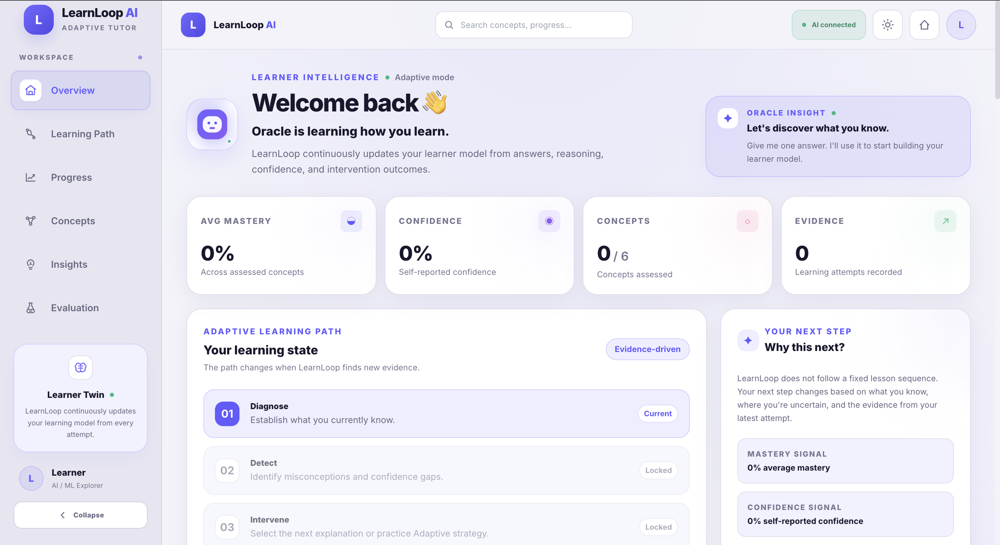
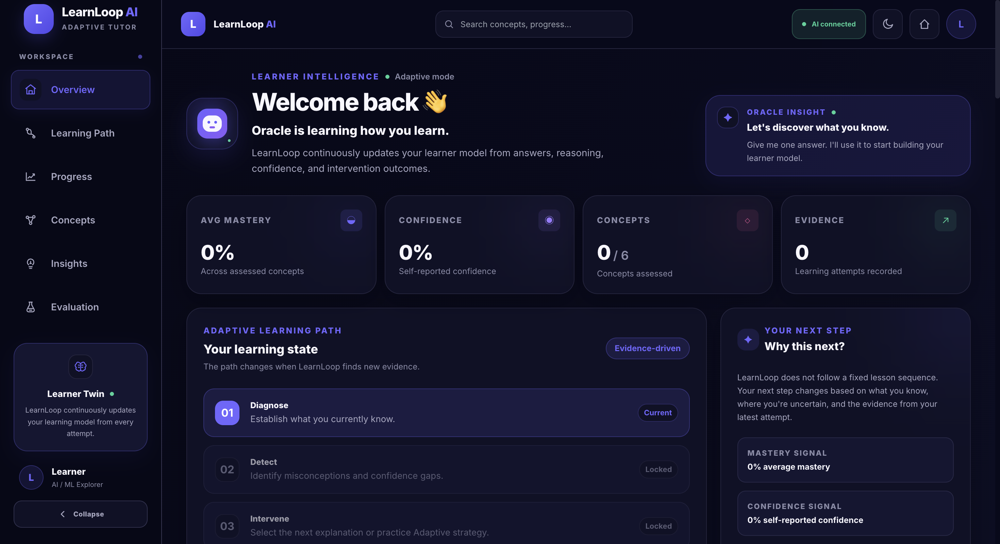

# LearnLoop AI

> **Most tutors know the subject. LearnLoop learns the learner.**

**Personalised AI Tutor for Learning AI**

**Team RudraCore** · **PS-03** · **Build Fast with AI — AI Build Challenge 2026**

[🌐 Live Demo](https://learnloop-ai-eight.vercel.app) ·
[💻 GitHub](https://github.com/techAsmita/LearnLoop-AI) ·
[⚙️ Backend API](https://learnloop-ai-vp36.onrender.com) ·
[📹 Demo Video] (https://drive.google.com/file/d/1sZZyDVhdxzcx3bDYxtMVuGXhfAvwkCE8/view?usp=sharing)





---

## 🚀 Live Project

| Resource | Link |
|---|---|
| 🌐 **Live Demo** | https://learnloop-ai-eight.vercel.app |
| 💻 **GitHub Repository** | https://github.com/techAsmita/LearnLoop-AI |
| ⚙️ **Backend API** | https://learnloop-ai-vp36.onrender.com |
| 🎥 **Demo Video** | https://drive.google.com/file/d/1sZZyDVhdxzcx3bDYxtMVuGXhfAvwkCE8/view?usp=sharing |
| 📑 **Project Presentation** | https://drive.google.com/file/d/10Q6iRQ2Bg8ixb7gIx6Qt2HMKopdtlH9n/view?usp=sharing |

### Recommended demo path

**High-confidence misconception → Targeted intervention → Reassessment → Learner-state update**

This demonstrates the complete adaptive loop rather than only showing generated AI content.

---

## 🧠 What is LearnLoop?

LearnLoop AI is a **learner-model-driven adaptive tutor** for learning AI/ML concepts.

Instead of giving every learner the same explanation and practice sequence, LearnLoop maintains an explicit learner state containing:

- Concept mastery
- Confidence
- Active misconceptions
- Attempt history
- Intervention history

The learner state determines **what the learner receives next — and why**.

### The Adaptive Loop

```text
Diagnose → Detect → Intervene → Reassess → Adapt
```

> **Same concept. Different learner state. Different next action.**

---

## 🔄 Core Adaptive Loop

```text
Learner State(t) + New Evidence
            ↓
       Policy Decision
            ↓
      Intervention
            ↓
       Reassessment
            ↓
Learner State(t + 1)
```

1. **Diagnose** — The learner submits an answer, their reasoning, and a confidence level. The system evaluates the response and builds a diagnosis.
2. **Detect** — The system identifies whether the learner holds a potential misconception.

   ```text
   Learner: "Training accuracy is high, so the model should generalize well."
   Detected misconception: High training performance implies strong generalization.
   ```

3. **Select intervention** — A deterministic learner-model policy chooses the intervention based on mastery, confidence, correctness, misconception presence and confidence, previous intervention, and reassessment history.
4. **Intervene** — The system delivers a foundational explanation, targeted misconception explanation, guided example, reinforcement, or practice challenge. Gemini can generate the content; the application policy controls the decision.
5. **Reassess** — The learner gets a follow-up question designed to check whether the underlying misconception has been addressed.
6. **Update** — The learner model is updated with the new evidence.

   ```text
   Before:  Mastery = 0.24, Active misconception = Yes
                 ↓  Targeted intervention → Reassessment
   After:   Mastery = Updated, Active misconception = Resolved / Persistent
   ```

7. **Adapt** — The next intervention is selected using the updated learner state.

---

## ✨ What Makes LearnLoop Different?

LearnLoop is not a generic ChatGPT-style educational chatbot. The learner state directly influences the next action:

| Learner state | Adaptive response |
|---|---|
| Incorrect + high confidence + strong misconception | Targeted misconception intervention |
| Incorrect + persistent misconception | Guided example |
| Correct + low confidence | Reinforcement |
| Low mastery without a clear misconception | Foundational explanation |
| Strong mastery + high confidence | Practice challenge |

Every adaptive decision is surfaced in the interface through **"Why this next?"**, making the adaptation observable rather than hidden behind an LLM.

---

## 🎯 Problem Statement

### PS-03 — Personalised AI Tutor for Learning AI

Traditional online learning systems often provide the same explanations, examples, and practice sequence to every learner. But two students can answer the same question incorrectly for completely different reasons:

- One learner may lack the basic concept.
- Another may have a specific misconception.
- Another may understand the concept but lack confidence.
- A strong learner may need a harder challenge rather than another explanation.

A useful AI tutor needs to understand **the learner**, not just the subject.

---

## 💡 Our Solution

LearnLoop maintains an explicit **learner model** and continuously adapts the learning path based on evidence from the learner. Two learners answering the same question can receive different interventions because their learner states are different.

Why we built LearnLoop: We wanted to move beyond generic AI tutoring by making the learner's evolving understanding—not just the subject matter—the input that determines what the tutor teaches next.

---

## 🏗️ System Architecture

```text
┌─────────────────────────────────────────────┐
│                Learner / UI                 │
│          Next.js + TypeScript               │
└──────────────────────┬──────────────────────┘
                       │
                       ▼
┌─────────────────────────────────────────────┐
│                  FastAPI                    │
│                 API Layer                   │
└──────────────────────┬──────────────────────┘
                       │
          ┌────────────┼────────────┐
          │            │            │
          ▼            ▼            ▼
┌──────────────┐ ┌──────────────┐ ┌──────────────┐
│   Gemini     │ │ Learner      │ │ PostgreSQL / │
│ Diagnosis &  │ │ Model +      │ │   Supabase   │
│ Content      │ │ Policy       │ │              │
└──────────────┘ └──────┬───────┘ └──────────────┘
                        │
                        ▼
             ┌─────────────────────┐
             │ Adaptive Learning   │
             │      Loop           │
             └─────────────────────┘
```

---

## 🤖 AI Architecture

One of the core architectural decisions is that **the LLM does not own the learner state or the final adaptive policy.**

```text
Learner Response
       │
       ▼
   Gemini Diagnosis
       │
       ▼
Structured Diagnosis
       │
       ▼
Deterministic Learner Policy
       │
       ├── Foundational explanation
       ├── Targeted misconception
       ├── Guided example
       ├── Reinforcement
       └── Practice challenge
       │
       ▼
Gemini-generated intervention content
       │
       ▼
Reassessment
       │
       ▼
Deterministic state update
```

**Gemini is used for:**

- Diagnosing learner responses
- Identifying potential misconceptions
- Estimating diagnosis-related signals
- Generating intervention content

**Deterministic Python logic controls:**

- Intervention selection
- Mastery updates
- Misconception persistence
- Reassessment evaluation
- State transitions
- Evaluation scenarios
- Decision explanations

This separation makes the system more explainable, testable, reproducible, and resilient to LLM failures.

---

## 🧠 Learner Model

Each learner-concept state contains:

```text
LearnerConceptState
├── mastery
├── confidence
├── active_misconceptions
├── attempt_count
├── last_intervention_type
├── history
└── updated_at
```

The state is updated after every learner interaction:

```text
State(t) + Evidence → State(t+1)
```

The system therefore has a persistent learner model rather than treating every question as an isolated conversation.

---

## 🎯 Adaptive Intervention Policy

The deterministic policy considers learner state when selecting the next intervention.

```text
Incorrect + High misconception confidence + Active misconception
        ↓
Targeted Misconception Intervention
```

```text
Correct + Low confidence
        ↓
Reinforcement
```

```text
Low mastery + Incorrect + No clear misconception
        ↓
Foundational Explanation
```

The policy also detects when a misconception persists after intervention and changes strategy:

```text
Targeted misconception → Misconception persists → Guided example → Reassessment
```

---

## 📊 Evaluation

LearnLoop includes a deterministic evaluation harness for testing whether learner-state changes actually produce different adaptive behavior.

```bash
cd backend
source .venv/bin/activate
python ../evaluation/run_evaluation.py
```

The evaluation is designed to answer one question:

> Does the system actually change its behavior when learner state changes?

| Metric | Result |
|---|---:|
| Adaptive policy accuracy | 100% |
| Strategy change rate | 66.7% |
| Misconception adaptation rate | 100% |
| Controlled simulated learning-gain difference | +0.017 |

**What each metric measures**

- **Adaptive policy accuracy** — whether the policy selects the intended intervention for controlled learner states.
- **Strategy change rate** — how often the adaptive policy changes strategy relative to the fixed baseline under different learner states.
- **Misconception adaptation rate** — whether the system changes strategy when a misconception persists.
- **Controlled learning-gain simulation** — a comparison of mastery transitions under the adaptive and fixed policies.

> The learning-gain benchmark is a **controlled simulation** using predefined learner scenarios and the implemented mastery-update logic. It is **not** a real-user learning study, and no real-world learning outcomes are claimed.

---

## 🧪 Test Coverage

```bash
cd backend
source .venv/bin/activate
pytest -v
```

The test suite covers:

- Health endpoint
- Concept retrieval
- Session creation
- Diagnostic flow
- Adaptive intervention selection
- Full adaptive learning loop
- Different learner states producing different interventions
- Mastery update determinism
- State persistence

---

## 🖥️ Demo Scenarios

The dashboard supports controlled learner-state scenarios:

**1. High-confidence misconception**

```text
Incorrect → High confidence → Misconception detected → Targeted intervention
```

**2. Correct but low confidence**

```text
Correct → Low confidence → Reinforcement
```

The concept is reinforced instead of being unnecessarily retaught.

**3. Low mastery**

```text
Low mastery → No clear misconception → Foundational explanation
```

Together these show the core product claim: **different learner states → different interventions.**

### 3-minute demo flow

```text
0:00 – 0:20   Problem + learner-model idea
0:20 – 0:50   Introduce learner state
0:50 – 1:30   Incorrect answer with high confidence → misconception detected
1:30 – 1:55   Targeted intervention → "Why this next?"
1:55 – 2:20   Reassessment → mastery and misconception state update
2:20 – 2:45   A different learner state → a different intervention
2:45 – 3:00   Evaluation + architecture + closing
```

---

## 🛠️ Technology Stack

| Layer | Technology |
|---|---|
| Frontend | Next.js 14, TypeScript, React, Tailwind CSS |
| Backend | FastAPI, Python, Pydantic |
| ORM / Database layer | SQLAlchemy |
| Database | PostgreSQL / Supabase (production), SQLite (local) |
| Generative AI | Gemini API (`google-generativeai`) |
| Evaluation | Python |
| Testing | pytest |
| Deployment | Vercel (frontend), Render (backend), Supabase (database) |
| Version control | Git + GitHub |

**Intentionally excluded:** LangChain, RAG, vector databases, multi-agent frameworks, and unnecessary orchestration layers. The architecture keeps the adaptive policy explicit and understandable.

---

## 🗂️ Project Structure

```text
LearnLoop_AI/
│
├── backend/
│   ├── app/
│   │   ├── __init__.py
│   │   ├── main.py
│   │   ├── config.py
│   │   ├── database.py
│   │   ├── models.py
│   │   ├── schemas.py
│   │   ├── seed.py
│   │   │
│   │   ├── routers/
│   │   │   ├── __init__.py
│   │   │   └── api.py
│   │   │
│   │   └── services/
│   │       ├── __init__.py
│   │       ├── learner_model.py
│   │       ├── gemini_ai.py
│   │       ├── mock_ai.py
│   │       └── evaluation.py
│   │
│   ├── tests/
│   │   ├── __init__.py
│   │   └── test_api.py
│   │
│   └── requirements.txt
│
├── frontend/
│   ├── src/
│   │   ├── app/
│   │   ├── components/
│   │   ├── lib/
│   │   └── types/
│   ├── public/
│   ├── package.json
│   └── ...
│
├── evaluation/
│   ├── __init__.py
│   ├── test_cases.py
│   └── run_evaluation.py
│
├── screenshots/
│   ├── learnloop-light-theme-hero.png
│   └── learnloop-dark-theme-hero.png
│
├── .env.example
├── .gitignore
├── run-local.sh
└── README.md
```

---

## ⚙️ Local Setup

### Prerequisites

- Python 3.10 or 3.11
- Node.js 18+
- npm
- PostgreSQL / Supabase (production deployment only)
- Gemini API key (live AI mode only)

A Gemini API key is **not required** to run the application in MOCK/DEMO mode.

### ▶️ Quick Start — MOCK / DEMO Mode

MOCK mode runs the entire adaptive workflow without an external AI API.

**1. Clone the repository**

```bash
git clone https://github.com/techAsmita/LearnLoop-AI.git
cd LearnLoop-AI
```

**2. Backend setup**

```bash
cd backend

python3 -m venv .venv
source .venv/bin/activate
```

On Windows:

```bash
.venv\Scripts\activate
```

Install dependencies and create the environment file:

```bash
pip install -r requirements.txt
cp ../.env.example .env
```

Start the backend:

```bash
uvicorn app.main:app --reload --port 8000
```

The backend will be available at `http://localhost:8000`, with interactive API docs at `http://localhost:8000/docs`.

**3. Frontend setup**

Open a second terminal:

```bash
cd LearnLoop-AI/frontend
npm install
echo "NEXT_PUBLIC_API_URL=http://localhost:8000" > .env.local
npm run dev
```

Open `http://localhost:3000`.

---

## ✨ Running with Gemini

To enable live Gemini-powered diagnosis and intervention generation:

1. Create a Gemini API key through Google AI Studio.
2. Add the key to `backend/.env`.
3. Disable MOCK mode.

```env
GEMINI_API_KEY=your_key_here
MOCK_MODE=false
```

The deterministic learner-model policy continues to control critical state updates and intervention selection.

If a Gemini request fails, the application falls back to demo mode so the learning workflow continues instead of crashing.

---

## 🗄️ Database

- **Local development:** SQLite
- **Production:** PostgreSQL / Supabase

The SQLAlchemy models support both environments. For production, configure:

```env
DATABASE_URL=postgresql://...
```

The application initializes the required tables on startup.

---

## 🔐 Environment Variables

**Backend**

```env
GEMINI_API_KEY=
MOCK_MODE=true
DATABASE_URL=sqlite:///./learnloop.db
CORS_ORIGINS=http://localhost:3000,http://127.0.0.1:3000
```

**Frontend**

```env
NEXT_PUBLIC_API_URL=http://localhost:8000
```

**Security:** never commit real credentials. These are intentionally ignored by Git:

```text
.env
.env.local
*.db
node_modules/
.next/
.venv/
```

A sanitized `.env.example` is included for reproducible setup.

---

## 🛡️ Reliability and Failure Handling

LearnLoop does not depend entirely on successful LLM calls. Because AI-generated reasoning and content are separated from deterministic learner-state management, the system can:

- Continue operating in MOCK/DEMO mode
- Fall back when Gemini is unavailable
- Test adaptive decisions deterministically
- Reproduce learner-state transitions
- Evaluate policy behavior independently of an LLM

This matters for a learning product, where an external model failure should not destroy the learner's session. The core adaptive behavior can also be reproduced locally without a paid AI service by running `pytest -v` and `python ../evaluation/run_evaluation.py`.

---

## 🎨 Product Design Principles

The interface is built around the learner's current state rather than a generic chatbot window. The dashboard surfaces:

- Current mastery
- Learning progress
- Active learner state
- Current lesson / intervention
- Adaptive next step
- "Why this next?"

The goal is to make the system's adaptation visible to both the learner and the evaluator.

---

## 🤖 AI Tools Disclosure

AI tools were used during development and are disclosed here as required by the Build Fast with AI challenge.

**1. Gemini API — used in the product itself**

Gemini is integrated into LearnLoop for learner-response diagnosis, misconception detection assistance, structured diagnostic output, and intervention content generation. The application does not delegate the entire learner model to Gemini; deterministic Python logic controls learner-state updates and intervention policy.

**2. Grok — development assistance**

Used for frontend development, code generation, UI implementation, and development iteration. Generated code was integrated, tested, modified, and validated as part of the project.

**3. ChatGPT — development and engineering assistance**

Used for architecture discussion, debugging assistance, code review and refinement, API and backend reasoning, evaluation design, documentation, testing strategy, and deployment preparation. All suggestions were reviewed and adapted to the project's actual implementation.

AI assistance was used as a development tool; the final architecture, integration, testing, evaluation design, and project decisions were made and validated by the team.

---

## 🧭 Design Decisions

**Why not make Gemini responsible for everything?**
Learner-state transitions and intervention policy need to be testable and explainable.

**Why not use a vector database?**
The problem does not require semantic retrieval over a large document corpus. The MVP focuses on learner adaptation, not knowledge retrieval.

**Why not use LangChain?**
The architecture does not require an orchestration framework. Direct model integration keeps the system simpler and easier to inspect.

**Why not use multiple agents?**
The core challenge is learner adaptation. Additional agents would add complexity without improving the central adaptive loop.

**Why use an explicit learner model?**
Because the central product claim is not *"The AI can explain AI."* It is:

> "The AI changes what it teaches based on what it learns about the learner."

---

## 🔮 Future Improvements

LearnLoop's current implementation focuses on the core adaptive learning loop. Potential next steps include:

- **Richer learner modeling** — incorporate long-term learning patterns, response-time signals, and concept dependencies.
- **Expanded evaluation** — evaluate adaptation with larger controlled datasets and eventually real learner studies.
- **Adaptive coding practice** — add executable coding exercises whose difficulty changes with learner performance.
- **Knowledge graph integration** — model prerequisite relationships between AI/ML concepts.
- **Multimodal tutoring** — support diagrams, visual explanations, and eventually voice-based interaction.
- **Teacher / mentor analytics** — provide aggregated insights into learner progress and recurring misconceptions.
- **Long-term personalization** — adapt learning paths across multiple sessions and concepts rather than a single learning cycle.

## 👥 Team RudraCore

| Member | Responsibility |
|---|---|
| Asmita Roy | Project Lead · AI / Backend |
| Akshita | Data & Evaluation |
| Yogita Rana | Development & Testing |

---

## 🏆 Challenge Submission

**Built for:** Build Fast with AI — AI Build Challenge 2026
**Problem Statement:** PS-03 — Personalised AI Tutor for Learning AI
**Team:** RudraCore

| Deliverable | Status |
|---|---|
| Runnable project | ✅ |
| GitHub repository | ✅ |
| Deployment | ✅ |
| 3-minute demo video | ✅ |
| Project PPT (max 10 slides) | ✅ |
| AI tools disclosure | ✅ |

---

## 📌 Project Summary

LearnLoop AI is an adaptive AI tutor built around an explicit learner model. It maintains mastery, confidence, misconceptions, history, and intervention history, and continuously updates that state:

```text
Diagnose → Detect → Intervene → Reassess → Adapt
```

The next action is determined by the learner's current state, not by a fixed learning path.

**Most tutors know the subject. LearnLoop learns the learner.**